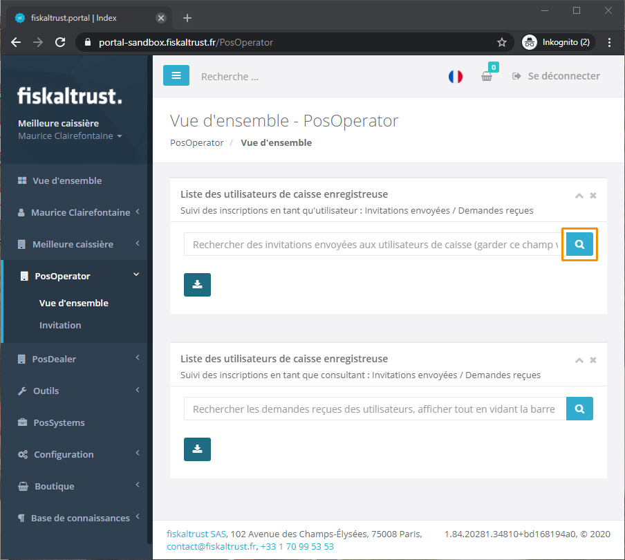
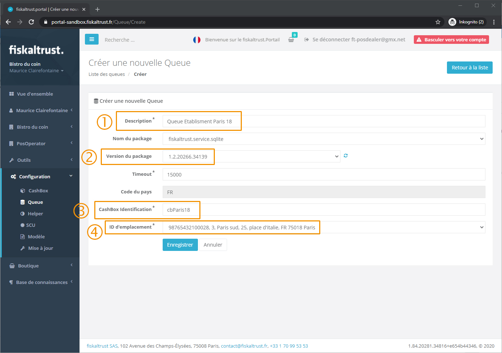

## Question

Wie erstelle ich das Produkt ChaîneLocale?

## Metadata tags

lang-de, lang-at, market-fr, middleware, PosCreator, PosDealer, PosOperator, Consultant

## Answer

Das Produkt ChaîneLocale ermöglicht die Verwendung der fiskaltrust.Middleware auf einem Kassensystem mit einer lokalen Installation. Diese Produkt ist kostenfrei und kann jederzeit über das [fiskaltrust.Portal](https://portal.fiskaltrust.fr/) erstellt werden. 
Dazu müssen mehrere Voraussetzung erfüllt sein.

### Voraussetzungen

Melden Sie sich als Kassenhändler (PosDealer) am [fiskaltrust.Portal](https://portal.fiskaltrust.fr/) an.

#### Kassenbetreiber (PosOperator) aktivieren

Öffnen Sie das Menü _PosOperator_ und dort die Überblicksseite und klicken Sie auf die Lupe im ersten Widget.

Klicken Sie auf den passenden PosOperator-Namen in der ersten Spalte um das PosOperator-Konto zu aktivieren.

#### SIREN und Firmennamen eintragen

Zunächst muss eine gültige SIREN in die Stammdaten des Unternehmens eingetragen und geprüft werden. Dazu aktivieren Sie die Stammdaten des Unternehmens.

Tragen Sie bei **1** den Firmennamen wie er im Handelsregister eingetragen ist ein. Bei **2** geben Sie die SIREN des Unternehmens ein. (Im Sandbox-Modus kann jede Zahl aus 9 Ziffern beispielsweise 987654321 verwendet werden). Danach klicken Sie auf den Prüfknopf **3** um die SIREN gegen das Handelsregister zu prüfen. Speichern Sie Daten mit dem Knopf am Endes des Fensters.

#### Niederlassung und SIRET eintragen

Klicken Sie am Ende des Menüs auf _Outlets_ um die Liste der Niederlassungen anzuzeigen.

Die erste Niederlassung ist immer der Firmensitz alle weiteren können zusätzliche ergänzt werden. Öffnen Sie die entsprechende Niederlassung bzw. legen Sie eine neue an.

In dem Fenster tragen Sie bitte die Adresse **1** der Niederlassung ein und danach im Feld _Location Id_ die SIRET der Niederlassung ein **2**. (Im Sandbox-Modus kann jede Zahl aus 14 Ziffern beispielsweise 98765432100012 verwendet werden. Die ersten 9 Ziffern müssen jedoch der verwendeten SIREN entsprechen.) Nun prüfen Sie die Siret mit dem Knopf an der rechten Seite **3** und speichern die Daten mit dem Knopf am unteren Fensterrand.

### Anlegen einer Signaturerstellungseinheit (SCU)

Die Signaturerstellungseinheit ist die Grundlage für die Sicherheit und Unveränderbarkeit der Daten. Einmal angelegt kann sie nicht mehr gelöscht werden. Sie ist ein grundlegender Bestandteil der Konfiguration der fiskaltrust.Middleware. Öffnen Sie im Menü _Konfiguration_ das Fenster für die SCUs.

Klicken Sie auf den Knopf _Anlegen_ um eine neue SCU zu erzeugen. Sie benötigen pro Outlet nur eine Signaturerstellungseinheit. Diese kann für mehrere CashBoxen verwendet werden.

Geben Sie der SCU einen beschreibenden Namen **1** und wählen Sie danach die Niederlassung **2** für diese Signaturerstellungseinheit aus.
Speichern Sie die Eingaben mit Knopf am unteren Rand des Fensters.

### Anlegen einer Queue

Die Queue ist der Speicherort aller Belege einer Filiale. Sie kann im Menü _Konfiguration_ angelegt und verwaltet werden.

Legen Sie eine neue Queue mit dem Knopf _Neu_ an. Sie brauchen pro Niederlassung mindestens eine Queue. Diese kann bis zu 10 POS System verwalten. Dazu muss sie von jedem einzelnen POS System im Netzwerk erreichbar sein.

Ergänzen Sie die Werte in diesem Fenster. Die Beschreibung **1** dient nur Ihnen um die Queue leichter zu identifizieren. Die Versionsnummer **2** muss richtig ausgewählt werden um den Gesetzen zu entsprechen. Die Identifikationder CashBox **3** muss um Konto einmalig sein und dient als interne Identifikation. Vor dem Speichern, wählen Sie noch die passende Niederlassung aus.

**Achten Sie bei der Auswahl der Niederlassung immer darauf, die richtige und immer dieselbe zu verwenden. Diese kann nachträglich *nicht* mehr verändert werden!**

Speichern Sie diese Konfiguration und fügen Sie im folgenden Fenster eine http-URL hinzu, ohne einen der anderen Werte zu ändern. Speichern Sie die Konfiguration.

### Zuordnen der SCU zur Queue

Um die Sicherheit der gespeicherten Belege in der Queue zu gewährleisten muss die Signaturerstellungseinheit mit der Queue verbunden werden.

Suchen Sie die kürzlich erstellte Warteschlange in der Liste. Auf der rechten Seite befinden sich vier Konfigurationsschaltflächen. Klicken Sie auf die erste (das Rechteck mit dem Pfeil).

Wählen Sie die SCU aus, die Sie im ersten Schritt erstellt haben, und klicken Sie auf _Speichern und schließen_.

**Seien Sie vorsichtig bei diesem Schritt, die SCU kann für diese Warteschlange nachträglich nicht mehr geändert werden!**

### CashBox einrichten

Um das POS-System mit der fiskaltrust.Middleware zu verbinden benötigen Sie den  virtuellen Konfigurationscontainer _CashBox_.

Im CashBox-Befehl des Konfigurationsmenüs müssen Sie auf die Schaltfläche _Hinzufügen klicken_.

Geben Sie eine _Beschreibung_ **1** ein und wählen Sie erneut dieselbe Niederlassung **2** wie in den vorherigen Schritten. Nachdem Sie auf _Speichern_ geklickt haben, finden Sie eine neue CashBox in der Liste.

Klicken Sie auf die Schaltfläche mit dem Hand-Symbol.

Ziehen Sie nun die kürzlich erstellte Warteschlange von rechts nach links. Überprüfen Sie, ob die richtige Niederlassung ausgewählt ist, und klicken Sie auf _Speichern_.

### Konfiguration erstellen

Nach jeder Änderung an der CashBox müssen Sie diese neue zusammenstellen.

Klicken Sie in der Zeile der CashBox auf die Schaltfläche *Rebuild Configuration* (Kreispfeile) **1**.
Jetzt können Sie einen der drei Launcher **2** herunterladen und die fiskaltrust.Middleware auf Ihrem lokalen POS-System installieren.
