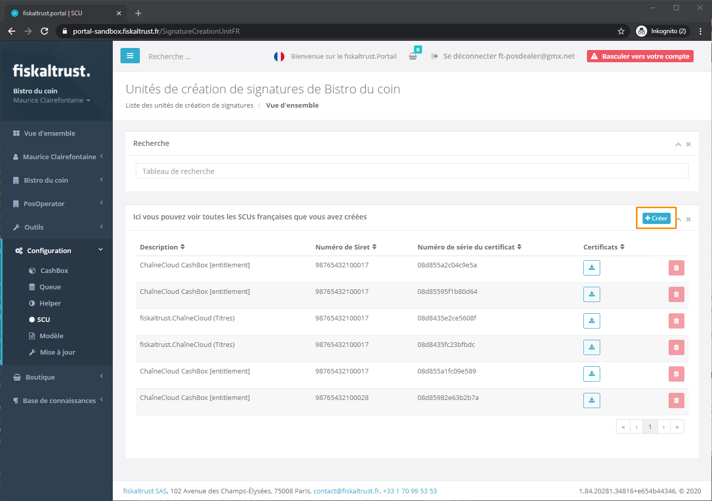
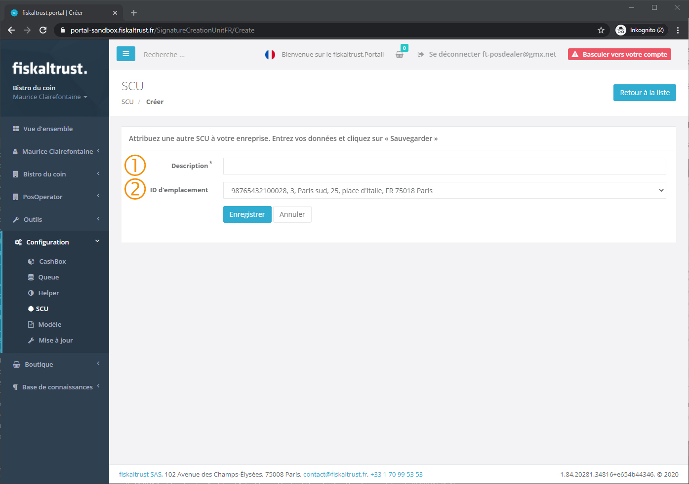
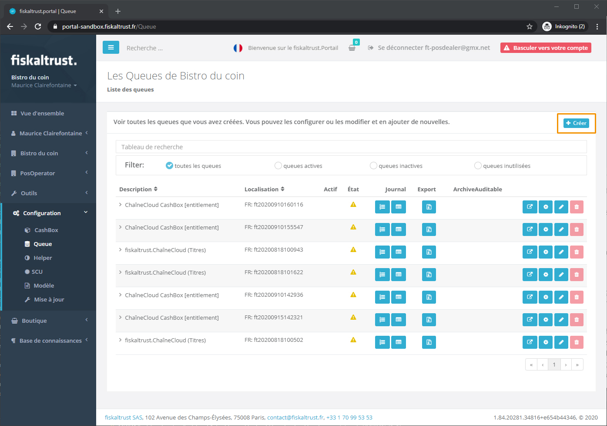
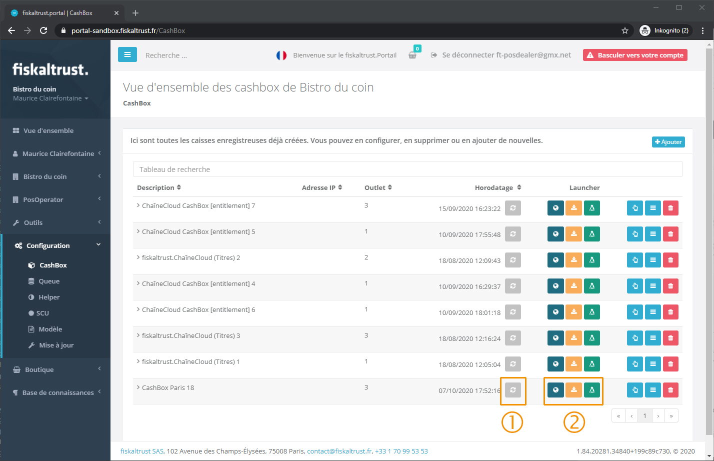

## Question

Comment créer le produit ChaîneLocale ?

## Metadata tags

lang-de, lang-at, market-fr, middleware, PosCreator, PosDealer, PosOperator, Consultant

## Answer

Le produit ChaîneLocale permet l'utilisation du middleware fiskaltrust.middleware sur un système de point de vente avec une installation locale. Ce produit est gratuit et peut être créé à tout moment via le [fiskaltrust.Portal] (https://proral.fiskaltrust.fr/). Plusieurs conditions doivent être remplies.

### Exigences

Inscrivez-vous en tant que distributeur de billets (PosDealer) sur le [fiskaltrust.Portal] (https://protal.fiskaltrust.fr/).

#### Activer l'opérateur de caisse (PosOperator)

Ouvrez le menu _PosOperator_ et là la page d'aperçu et cliquez sur la loupe dans le premier widget.

Cliquez sur le nom du PosOpérateur correspondant dans la première colonne pour activer le compte du PosOpérateur.

#### Entrez le SIREN et le nom de la société

Tout d'abord, un SIREN valide doit être saisi et vérifié dans les données de base de l'entreprise. Pour ce faire, vous activez les données de base de l'entreprise.

Inscrivez la raison sociale telle qu'elle figure dans le registre du commerce à **1**. A **2**, entrez le SIREN de l'entreprise. (En mode "Sandbox", n'importe quel numéro à 9 chiffres peut être utilisé, par exemple 987654321). Cliquez ensuite sur le bouton de contrôle **3** pour comparer le SIREN avec le registre du commerce. Enregistrez les données à l'aide du bouton situé à la fin de la fenêtre.

#### Registre des succursales et SIRET

Cliquez sur _Outlets_ à la fin du menu pour afficher la liste des branches.

Die erste Niederlassung ist immer der Firmensitz alle weiteren können zusätzliche ergänzt werden. Öffnen Sie die entsprechende Niederlassung bzw. legen Sie eine neue an.

La première branche est toujours le siège de l'entreprise, toutes les autres peuvent être ajoutées. Ouvrez la succursale correspondante ou créez-en une nouvelle.

### Création d'un unite de création de signature (SCU)

Le dispositif de création de signature est la base de la sécurité et de l'inaltérabilité des données. Une fois créé, il ne peut être supprimé. Il s'agit d'un élément de base de la configuration du middleware fiskaltrust.com. Ouvrez la fenêtre pour les SCU dans le menu _Configuration_.

Cliquez sur le bouton _Créer_ pour créer une nouvelle UCS. Vous n'avez besoin que d'une seule unité de création de signature par point de vente. Il peut être utilisé pour plusieurs CashBox.

Donnez à la SCU un nom descriptif **1** et sélectionnez ensuite la branche **2** pour ce dispositif de création de signature.
Sauvegardez les entrées avec le bouton en bas de la fenêtre.

### Créer une Queue

La file d'attente est le lieu de stockage de tous les documents dans un magasin. Il peut être créé et géré dans le menu Configuration.

Créez une nouvelle Queue avec le bouton _Nouveau_. Il faut au moins une file d'attente par agence. Elle peut gérer jusqu'à 10 systèmes de points de vente. Pour ce faire, il doit être accessible à partir de chaque système de point de vente individuel du réseau.

Complétez les champs dans cette fenêtre. La description **1** est uniquement destinée à vous aider à identifier la file d'attente. Le numéro de version **2** doit être sélectionné correctement pour être conforme à la loi. L'identification CashBox **3** doit être unique par compte et est utilisée comme identification interne. Avant d'enregistrer, sélectionnez la branche appropriée.

**Lorsque vous choisissez une succursale, assurez-vous de toujours utiliser la bonne et toujours la même. Cela ne peut pas être modifié par la suite !**

Enregistrez cette configuration et ajoutez un http-URL dans la fenêtre suivante sans modifier aucune des autres valeurs Sauvegardez la configuration.

### Affectation de la SCU à la Queue

Pour assurer la sécurité des documents stockés dans la file d'attente, le dispositif de création de signature doit être connecté à la file d'attente.

Trouvez la file d'attente récemment créée dans la liste. Il y a quatre boutons de configuration sur le côté droit. Cliquez sur le premier (le rectangle avec la flèche).

Sélectionnez la SCU que vous avez créée lors de la première étape et cliquez sur _Save and close_.

**Attention à cette étape, la SCU de cette file d'attente ne peut pas être modifié par la suite !

### Mettre en place de CashBox

Pour connecter le système POS avec le fiskaltrust.middleware, vous avez besoin du conteneur de configuration virtuel _CashBox_.

Dans la commande CashBox du menu de configuration, vous devez cliquer sur le bouton _Ajouter_.

Entrez une _description_ **1** et sélectionnez à nouveau la même branche **2** que dans les étapes précédentes. Après avoir cliqué sur _Save_, vous trouverez une nouvelle CashBox dans la liste.

Cliquez sur le bouton avec le symbole de la main.

Faites maintenant glisser la file d'attente récemment créée de droite à gauche. Vérifiez que la bonne branche est sélectionnée et cliquez sur _Save_.

### Créer une configuration

Après chaque modification de la CashBox, vous devez compiler cette nouvelle.

Cliquez sur le bouton *Rebuild Configuration* (flèches circulaires) **1** dans la ligne CashBox.
Vous pouvez maintenant télécharger l'un des trois lanceurs **2** et installer le middleware fiskaltrust.middleware sur votre système de point de vente local.
